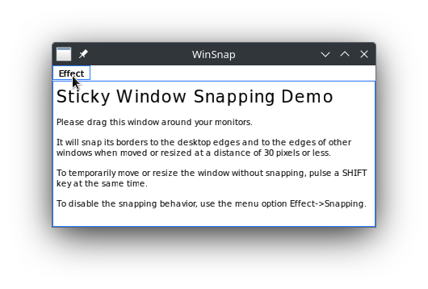

Sticky Window Snapping Demo for Qt and WIN32
============================================

This is not the same as [Aero Snap](https://en.wikipedia.org/wiki/Windows_Aero#Windows_7)!

This demo window will snap its borders to the desktop edges and to the edges of other windows when moved or resized at a distance of 30 pixels or less.

To temporarily move or resize the demo window without snapping, pulse a SHIFT key at the same time.

To disable the snapping behavior for some larger time, use the menu option Effect->Snapping.

Antecedents
-----------

This is an incomplete list of other Windows programs implementing sticky window snapping.

* [Winamp](https://www.winamp.com/)

This program, published in the nineties of the past century was the first one including the sticky window snapping feature, and was very influential not only for that, but also was one of the earlier MP3 players that contributed to the digital media revolution that shacked the recording industry. 

* [VanBasco Karaoke Player](http://www.vanbasco.com/en/karaokeplayer/)

This is a MIDI and karaoke player almost as old as Winamp. It also has the sticky window snapping feature.

* [Virtual MIDI Synth](https://coolsoft.altervista.org/en/virtualmidisynth)

A software synthesizer, soundfont based, very configurable and much more contemporary than the others. It includes the snapping feature since 2014 in v1.12.0

They all have in common an user interface based on mostly fixed and small sized windows, that benefit from the manual arrangement provided by sticking the edges together. Compare the result to the "Aero snap" which resizes the windows to fill the whole or the entire height of the screen. This only works well with some types of programs. 

Other implementations
---------------------

* macOS Sierra

Mac users now have a window snapping feature built directly into Mac OS, which allows users to easily snap windows to aspects of the screen or against one another. This offers a nice way to quickly and precisely align windows.  More about it, [here](https://osxdaily.com/2016/12/06/use-window-snapping-mac/).

* KDE and GNOME (Linux)

Sticky Window Snapping is a standard feature of the KWin and Mutter window managers, among others.

There are also 3rd party window managers for Windows that implement Sticky Window Snapping for all windows programs, but the user must find, buy and install one first. It is reasonable that some windows programs include this functionality without external helpers. This is not necessary in the case of macOS and Linux. 

Cross-compiling from Linux
--------------------------

You may build this project from Linux using [MinGW](https://en.wikipedia.org/wiki/MinGW). You need to provide a toolchain file from the command line when running cmake, for instance:

~~~
$ cmake -S winsnap \
        -B build-winsnap \
        -DCMAKE_GENERATOR:STRING='Unix Makefiles' \
        -DCMAKE_BUILD_TYPE:STRING=Debug \
        -DCMAKE_TOOLCHAIN_FILE:FILEPATH=/usr/share/mingw/toolchain-mingw64.cmake
~~~

To run the program under Linux, use [Wine](https://www.winehq.org/).

Credits and Licenses
--------------------

Copyright (C) 2021-2023 Pedro López-Cabanillas <plcl@users.sourceforge.net>
 
This program is free software: you can redistribute it and/or modify it under the terms of the GNU General Public License as published by the Free Software Foundation, either version 3 of the License, or (at your option) any later version.

This program is distributed in the hope that it will be useful, but WITHOUT ANY WARRANTY; without even the implied warranty of MERCHANTABILITY or FITNESS FOR A PARTICULAR PURPOSE.  See the GNU General Public License for more details.

You should have received a copy of the GNU General Public License along with this program.  If not, see <https://www.gnu.org/licenses/>.

The files "winsnap.cpp" and "winsnap.h" are derived from the project [window-snapper by Nicholas Cook](https://github.com/npcook/window-snapper), whose original license follows:

Copyright (c) 2014 mmbob (Nicholas Cook)

Permission is hereby granted, free of charge, to any person obtaining a copy of this software and associated documentation files (the "Software"), to deal in the Software without restriction, including without limitation the rights to use, copy, modify, merge, publish, distribute, sublicense, and/or sell copies of the Software, and to permit persons to whom the Software is furnished to do so, subject to the following conditions:

The above copyright notice and this permission notice shall be included in all copies or substantial portions of the Software.

THE SOFTWARE IS PROVIDED "AS IS", WITHOUT WARRANTY OF ANY KIND, EXPRESS OR IMPLIED, INCLUDING BUT NOT LIMITED TO THE WARRANTIES OF MERCHANTABILITY, FITNESS FOR A PARTICULAR PURPOSE AND NONINFRINGEMENT. IN NO EVENT SHALL THE AUTHORS OR COPYRIGHT HOLDERS BE LIABLE FOR ANY CLAIM, DAMAGES OR OTHER LIABILITY, WHETHER IN AN ACTION OF CONTRACT, TORT OR OTHERWISE, ARISING FROM, OUT OF OR IN CONNECTION WITH THE SOFTWARE OR THE USE OR OTHER DEALINGS IN THE SOFTWARE.
